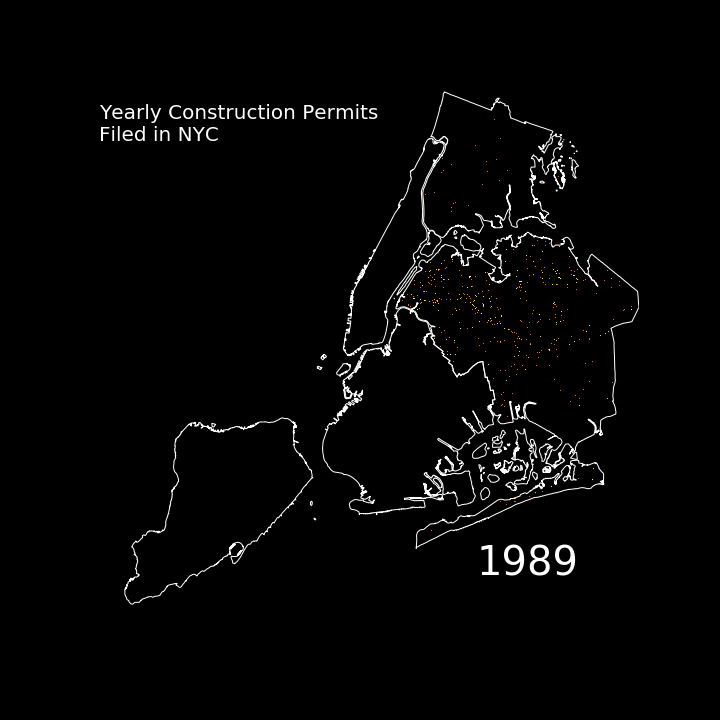

## Portfolio - Data Science Projects

---

### Machine Learning

#### [Fire Hydrant Inspection Prioritisation Scheme using Predicted Latent Fire Risk](https://pennmusa.github.io/MUSA_801.io/project_12/index.html)

Capstone project for the MUSA800 course in the School of Design, Upenn. The project was to build a inspection prioritization scheme for the Philadelphia Fire Department. 
 

<h4><a href="https://leannechan.github.io/foodInspect.html" title="Food Inspections">Predicting Food Establishment Inspection Failures in Chicago</a></h4>

  

Distribution of various risk factors across Chicago.

 

 ROC Curve - A measure of performance of the classification model.

<h4><a href="https://leannechan.github.io/sexualAssault.html" title="Sexual Assault">Predicting Geospatial Risk - Sexual Assault Risk in Chicago</a></h4>
 

Plot shows the predictions of counts of sexual assault cases of various models compared to the true count of sexual assault cases. 

<h4><a href="https://leannechan.github.io/homePrices.html" title="Home Prices">Predicting Home Prices in San Francisco</a>
</h4>

The plot shows the distribution of predicted home prices compared to observed home prices.

<h4><a href="https://leannechan.github.io/housingCredit.html" title="Housing Credit">Classification - Predicting Take Up Rates of Housing Credit Programme in Philadelphia to Optimise Cost</a></h4>
 

 Plot shows fraction of true positive, false positives, true negatives and false negatives as a result of model predictions at different thresholds. 

#### Predicting Severity of Traffic Accidents in Philadelphia 
[Report](/pdf/CIS_519_Project_Report.pdf) 

[Summary Sldies](/pdf/cis519_summary_slides.pdf)

---
### Data Visualisation 

- [Visualising Gentrification in New York City](https://leannechan.github.io/Gentrification-Trends-In-NYC/.) 
Project with Yap Yun Qi. 
The following plot shows the price to size for each NYC borough over recent years. 
 

- Handling Big Data - 3 Million Points, 1 GIF

---
### Webmapping

- [Hydrant Inspector Application](https://njxinran95.github.io/PhillyFire_App/) 

Application built as part of the machine learning project to build a fire hydrant inspection scheme for the Philadelphia Fire Department. 
 
- [Recycling Points in Singapore](https://leannechan.github.io/MUSA611_Midterm/)
 

---

Page template forked from <a href="https://github.com/evanca/quick-portfolio">evanca</a>

<!-- Remove above link if you don't want to attibute -->
